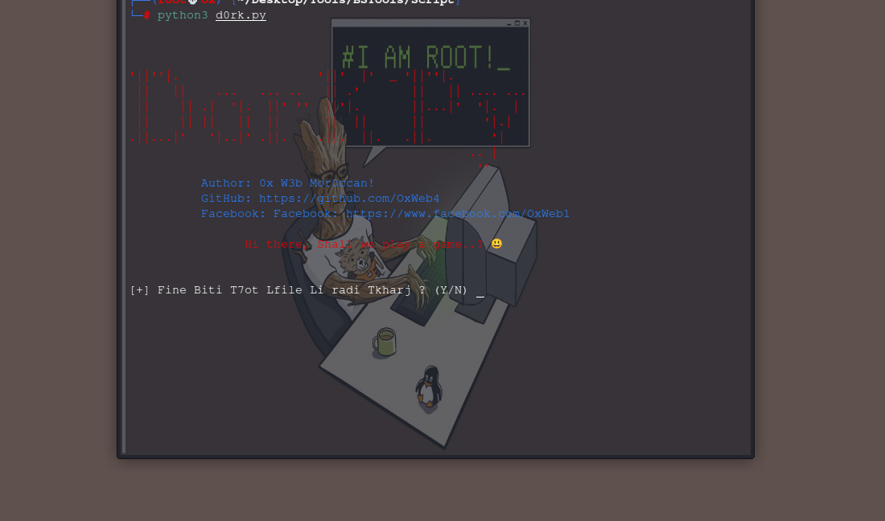

# d0r!k 
d0r-k Google Hacking Dork Scraping and Searching Script. d0r-k  is a script I made in python 3. With this tool, you can easily find Google Dorks.d0r-k collects potentially vulnerable web pages and applications on the Internet or other awesome info that is picked up by Google's search bots. Author: 0x W3b Mor0ccan!-BlaCk Scur!rty Team!

# Linux
* [+] git clone https://github.com/OxWeb4/d0r-k.git

* [+] cd d0r-k

* [+] pip3 install -r requirements.txt

# D0r-k Usage Linux

* [+] python3 D0r!k.py

That’s all ..!
Have fun 😃
****

* [+] Author : 0x W3b Mor0ccan!
* [+] [Facebook Personal](https://www.facebook.com/OxWeb1)
* [+] [Github](https://github.com/OxWeb4)

